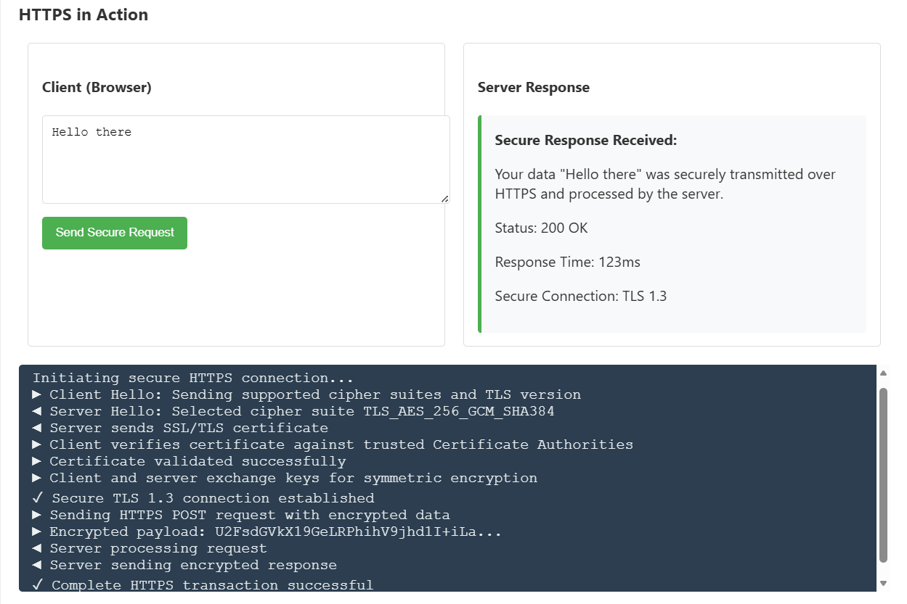

# 🔐 Secure Cryptography Operations


A **web-based cryptography demonstration project** showcasing **secure data storage**, **secure data transmission**, and **digital authentication** using modern cryptographic techniques such as **AES encryption**, **conceptual HTTPS/TLS**, and **RSA digital signatures**.

---

## 📌 Project Motivation

Understanding cryptography only at a theoretical level can be limiting.  
This project was built to **visually demonstrate how real-world security mechanisms work together** in modern applications — from encrypting stored data to verifying authenticity using digital signatures.

---

## ✨ Key Features

### 🔐 AES-Based Secure Storage
- Encrypts sensitive data using **AES (Advanced Encryption Standard)**
- Password-based encryption
- Produces secure ciphertext
- Decrypts data using the same secret key

### 🌐 HTTPS Secure Transmission (Conceptual)
- Simulates **HTTPS client–server communication**
- Visualizes **TLS 1.3 handshake steps**
- Demonstrates encrypted request and response flow
- Highlights the role of HTTPS in secure data transmission

### ✍️ RSA Digital Signatures
- RSA public–private key pair generation
- SHA-256 hashing
- Digital signing using private key
- Signature verification using public key
- Ensures **authenticity, integrity, and non-repudiation**

---

## 🛠️ Tech Stack

| Category | Technologies |
|--------|-------------|
| Frontend | HTML, CSS, JavaScript |
| Cryptography | CryptoJS (AES), JSEncrypt (RSA) |
| Hashing | SHA-256 |
| UI | Bootstrap |

---

## 📸 Screenshots

> The following screenshots demonstrate each cryptographic operation performed in the application:

### 1️⃣ User Interface


### 2️⃣ AES Encryption


### 3️⃣ AES Decryption


### 4️⃣ HTTPS Secure Transmission


### 5️⃣ RSA Digital Signature Verification


---

## ⚠️ Important Disclaimer (Read This)

> **Note:**  
> The HTTPS/TLS workflow shown in this project is a **client-side conceptual simulation** created purely for educational visualization.  
> Actual TLS encryption requires a backend server and trusted SSL certificates.

✔ AES encryption and RSA digital signature operations are **real and functional**  
✔ TLS steps are **visually simulated**, not transport-layer enforced

This ensures the project remains **technically honest and interview-safe**.

---

## 🎯 Learning Outcomes

By working on this project, one can understand:
- How symmetric encryption (AES) secures stored data
- How HTTPS/TLS protects data during transmission
- How RSA digital signatures ensure authenticity and integrity
- The difference between **real cryptographic operations** and **conceptual security simulations**
- How multiple security layers work together in real systems

---

## 🚀 How to Run the Project

1. Clone the repository:
   ```bash
   git clone https://github.com/your-username/secure-cryptography-operations.git
